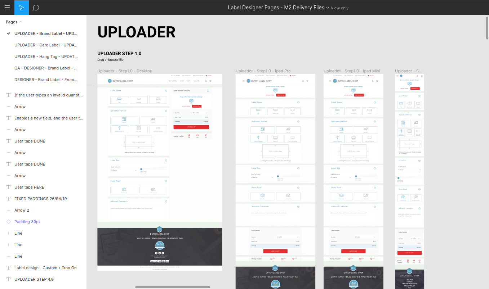
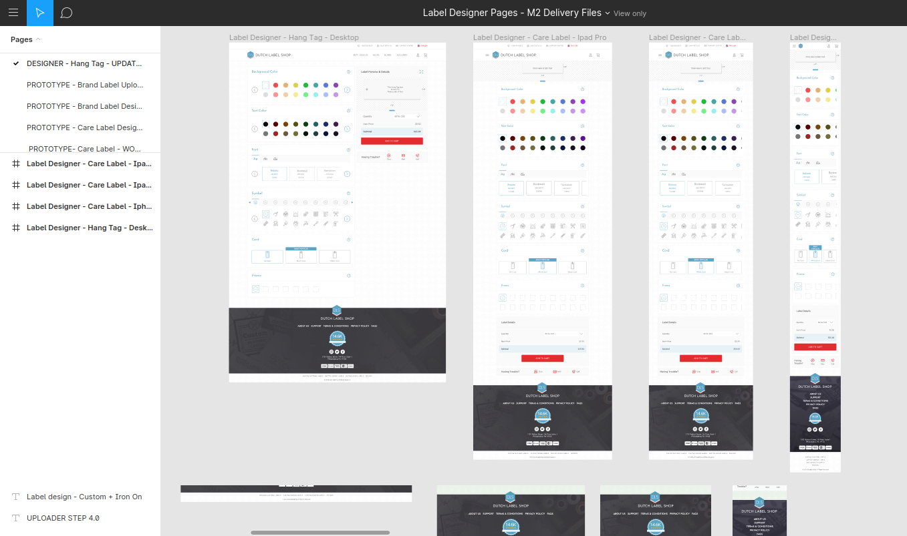
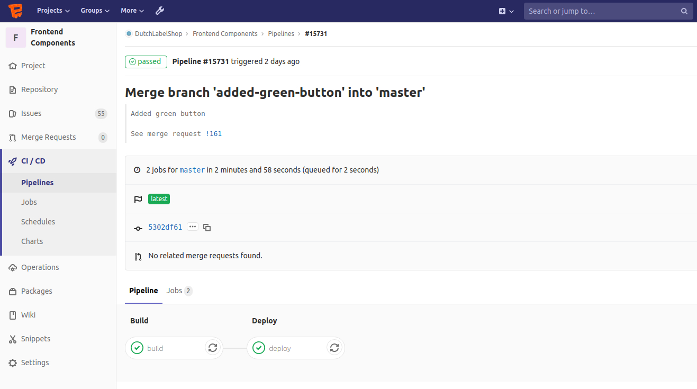
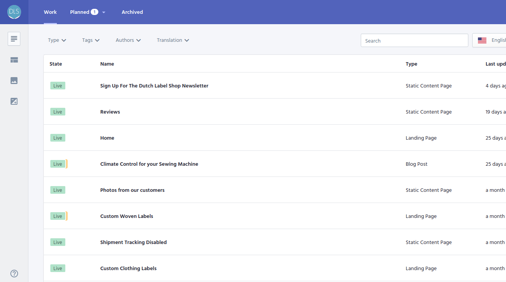
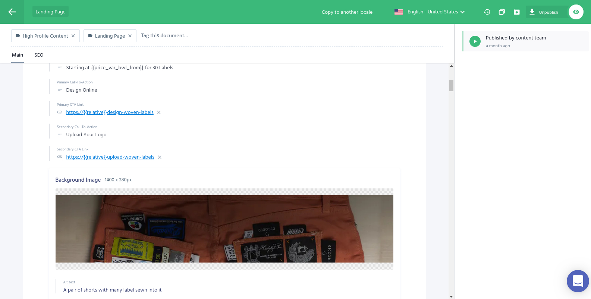
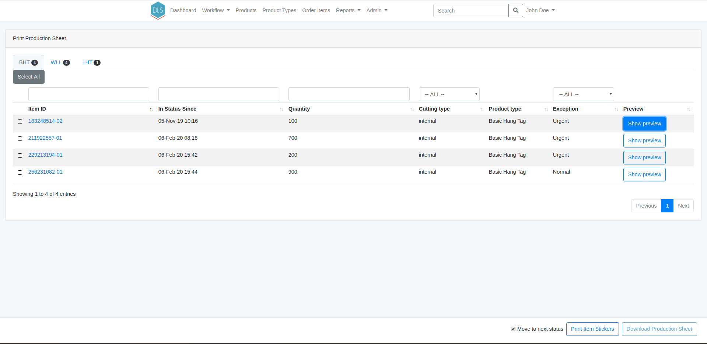

A completely revamped Magento 2 e-commerce platform to drive Dutch Label Shop's success in the custom label market.

## Dutch Label Shop
In the age of ecommerce and Etsy, crafters are afforded the opportunity to bring their passions to life in a way like never before. Boutique owners can now turn a collection of handmade garments into a profitable and professional brand. Dutch Label Shop offers these creative artisans a line of products to proudly and definitively identify their work as their own. Dutch Label Shop offers four types of high-quality customized labels —Brand, Size, Care, and Hang Tags— in quantities as low as 30.

## The challenge
Dutch Label Shop approached us to do a rebuild of their IT infrastructure. Their previous shop (also built by us) was running on Magento 1, which is approaching end of life in June 2020. 

A large part of the codebase was for processing of the orders after they were placed to support the production process. We leapt at the opportunity to re-architect the codebase to make the system more robust, flexible and versatile.

We planned our work in two-week sprints and our client spent one day a week at our office to guarantee a short feedback cycle.

## Migrating from Magento 1 to 2

We had many years of customizations built into the Magento 1 installation which culminated in 75 custom-built extensions. Our first step was to sit with the client team to discuss every single extension that we used in the Magento 1 shop and assess whether we need to skip it, port it or find an alternative for the Magento 2 build.

## Service Oriented Architecture

The project consists of many different but inter-related parts. In the Magento 1 webshop we had incorporated everything into Magento 1, which eventually proved not the best solution. Magento is great at what its built for but forcing it to take on responsibilities it wasn't meant to have pushed us from time to time in awkward positions. We decided to take a service oriented architecture approach, segmenting the different but inter-related parts of the codebase into systems that do that particular job best and eventually weave it into the Magento fabric.

This meant splitting the system up in a number of distinct parts;

- Frontend components
- Content management
- Product designers & uploaders
- Product library
- Pricing library
- A number of microservies for smaller tasks
- A middleware layer for the production facility

This case study will expand on each of them to shed some light on how we think a modern Magento 2 stack could function.

## Frontend components

The designer at Dutch Label Shop designed the website in close collaboration with our frontend team. The new shop was designed using Figma, which allowed us to easily collaborate on the designs and the frontend implementation with the team at Dutch Label Shop.

Having a single source of truth with versioning and full transparency & history was a great advantage when transforming the designs into an actual frontend implementation. To create a uniform look and feel completely tailored to Dutch Label Shop's visual identity, we decided to create all frontend components from scratch and not fall back on any defaults (whether from Magento or another third party library). To achieve this, we built a component library and a styleguide using [Fractal.js](https://fractal.build/) - trusted by City of Boston, City of Ghent, Liip and Eurostar among others.

Building the frontend components in the component library created a short feedback cycle between our frontend developers and the client team - every change our developers made would trigger a build pipeline that would update the component library. The client team could then quickly check progress and adjust where necessary.

After all components were created and the HTML and CSS for them was ready, we implemented the HTML into our Magento 2 theme. The CSS is directly included from the component library, eliminating all Magento-core CSS. This optimizes the delivery of CSS - no unused CSS is sent to the visitor's browser.

## Content management

Accompanying the Magento 1 webshop, the customer had a Wordpress site running for all blog content. Unifying the blog content with other site content was a big wish from the clients' content team. So we were in the market for a content management system that allowed us to:

- Flexibly create content types (such as blogs, landing pages, faqs, etc)
- Have granular control over users and permissions
- Preview content in the actual design
- See the history of changes in content (versioning)
- Manage every content item in multiple languages
- Fetch all the content through a REST (or GraphQL) endpoint

These requirements boiled the list down to a few systems;

- Contentful
- Cockpit
- Butter CMS
- Prismic.io
- DatoCMS

We had several calls with each of these and reviewed their demos thoroughly with the client's content team to see which system best suited our requirements and preferences. We eventually decided to go with [Prismic.io](https://prismic.io/non-developer).

Unfortunately, there was no Magento 2 extension available to connect Prismic with Magento 2 to create a seamless experience for the content team. Since we were (and still are!) so enthousiastic about Prismic, we decided to write the extension ourselves. We also open sourced it - you can find it on our [Github repo elgentos/magento2-prismicio](https://github.com/elgentos/magento2-prismicio).

## Product designers & uploaders

## Product library

## Pricing library

## Microservices

### PDF to PNG

### Color Extractor
In the Magento 1 shop, customers had to pick the colors that were present on the label. For the new shop, the client wanted this process to be automatic. With the help of machine learning, the colors are automatically extracted from the image. The color information is then saved in Magento and used during the production process. 

### Translations

### Image generation

## Business processes

The main responsibility for the middleware is to track the production of orders. Because the processes were built into the Magento 1 shop, we had to port them to the middleware. This gave us a nice opportunity to revisit the processes. First, we needed to see what the current process looked like. Fortunately, the processes were already documented by Dutch Label Shop because they operate as a fully remote company. 

In this case, well crafted documentation did not only help getting new employees up to speed quickly, but it also helped us to see what the current process looked like. 

Next up was defining how the new process should look. To do this, we had multiple sessions with the client to visualize the entire workflow. We made a flowchart in [Lucidchart](https://www.lucidchart.com/). The great thing about Lucidchart is the collaboration feature. For us, this meant that we could work together with the client on the same chart at the same time. 

## Middleware

At the heart of the new shop is the custom middleware, the Order Management System or OMS for short. We built the OMS on top of Laravel, the PHP framework. 

After building the flowchart, we had a clear vision about how the entire production process should flow through the application. With this in mind, we could start building the foundation of the application. For this, we broke down the application into its smallest part: the screen.

### Screens
The production process consists of a number of steps. Some of these steps have one or multiple people working on it. These people only need to see the information relevant to them at that time. For this, we created screens. A screen is an overview page with all the orders that are in that step of the workflow. A screen can contain multiple actions that are different per context. A factory employee can look at the orders in his step and only focus on those orders. Orders can then be sent to the next step in the workflow or be sent back, for example, when something went wrong during production. 

### Permissions
One of the most important features of the OMS is the permission system. In the production process, an employee is responsible for one or multiple steps. With the permission system, we can limit the employee to only see specific screens that are needed for his task. Within the workflow, permissions are connected to each step. As an extra precaution, the permission for each order is handled by the workflow. When an order goes to the next step, the workflow automatically checks what permission is connected to that step. This permission is then added to the order, so the right employee sees it. 

In addition to showing/hiding entire orders for employees, we also have the opportunity to hide specific pieces of information. For example, a factory worker can not see any client or financial information but only sees the information relevant for the task. 

### Notification Manager
When an order goes through the entire production process, Magento needs to continually be updated. For this, we wrote the notification manager. On the OMS side, every (whitelisted) action triggers a notification to Magento. Based on this, Magento picks up the notification and checks if it needs to perform an action. For example, it's possible to order a product that has a photoproof. When the customer does this and the order reaches the photoproof stage of the production process, OMS sends a notification to Magento. This notification contains all the data neccesary for a mail to be sent to the customer notifying him of the photoproof. 

The notification manager is also used with shipping notifications. OMS is responsible for creating the shipments and sending them to the fulfillment services. The fulfillment services relay the shipment tracking data to OMS, which in turn moves the order along the workflow and sends the shipment tracking data to Magento via the notification manager. Magento then sends shipment tracking data to the customer via email until the shipment is delivered. 

